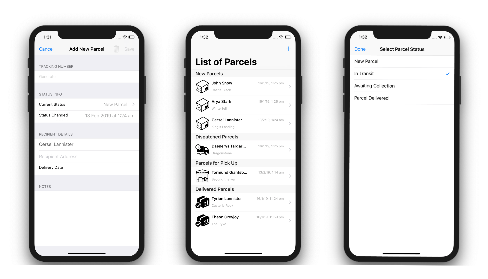
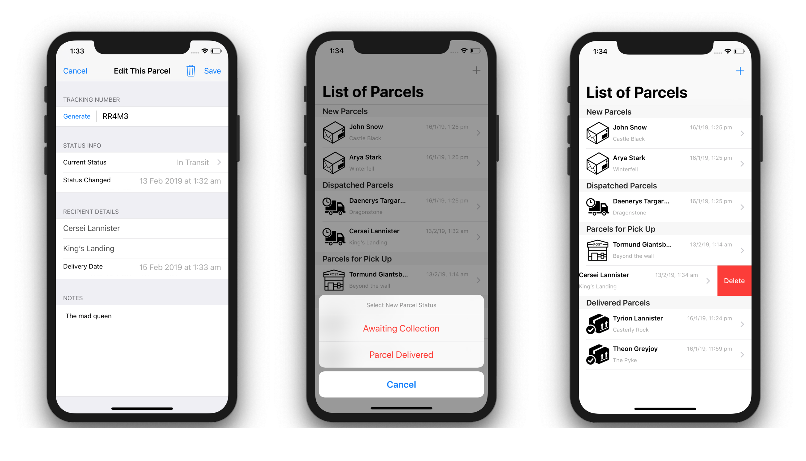

# Delivery Tracking

Delivery Tracking is a simple delivery application that tracks parcels statuses from creation to delivery.

### Description

Delivery tracking is for logging purposes to keep track of the parcels being received and sent for delivery. Application has a parcel list screen divided into sections for viewing the list of parcels that has already been entered. It has an input screen for new parcels and edit screen for viewing and editing parcels. 

When adding a new parcel, some fields will be unavailable. Upon dispatch, tracking number will be available for amendment. At different stages throughout the delivery, user can go back into the app and edit the information to reflect the progress. Changing parcels' status can also be made in the list screen by clicking their respective image.

### Screenshots

### License

Delivery System is available under the MIT License. See the [LICENSE](https://github.com/arvnq/DeliverySystem/blob/master/LICENSE) file for more info

